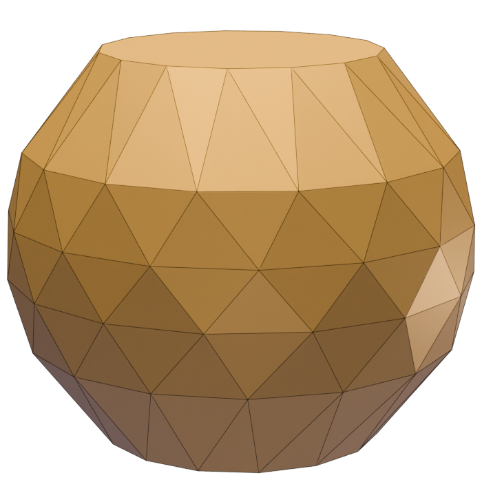

---
# Feel free to add content and custom Front Matter to this file.
# To modify the layout, see https://jekyllrb.com/docs/themes/#overriding-theme-defaults

# layout: home
usemathjax: true
---

Useful links:

* [Blueprint]({{ site.url }}/blueprint/)
* [Blueprint as pdf]({{ site.url }}/blueprint.pdf)
* [Dependency graph]({{ site.url }}/blueprint/dep_graph_document.html)
* [Doc pages for this repository]({{ site.url }}/docs/)
